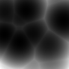
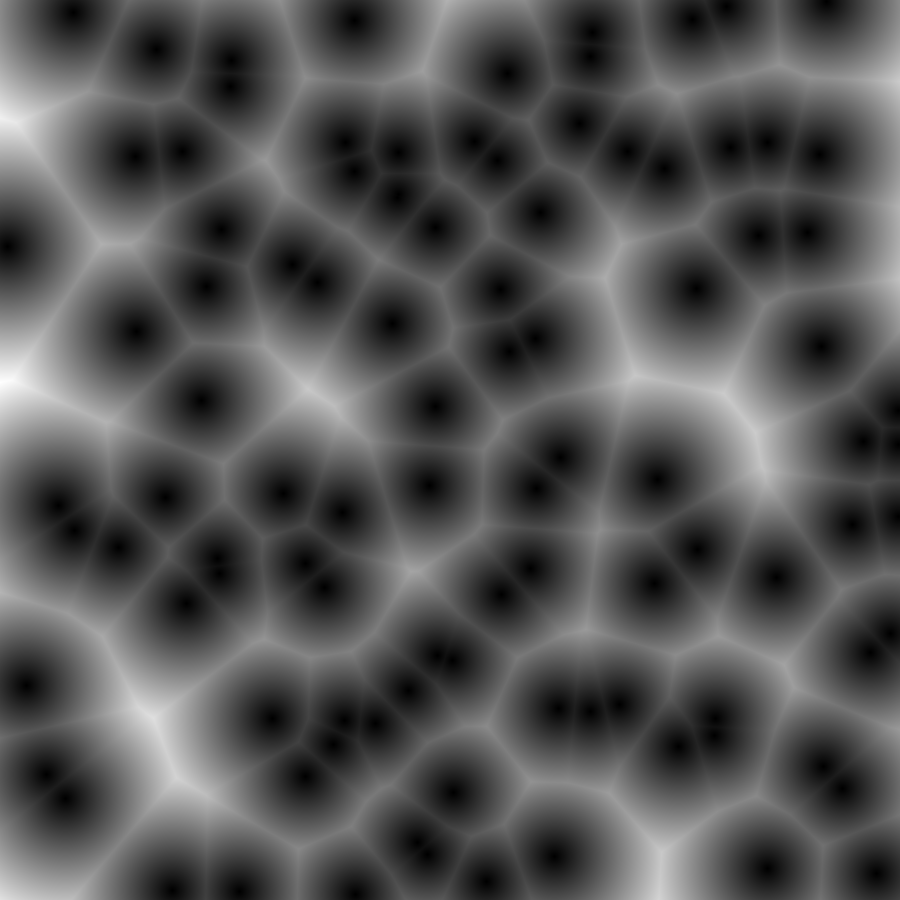

# Worley Noise Generator

This is a simple implementation of Worley Noise in Java. It is not optimized in any manner, and is meant to be a simple example of how to generate Worley Noise.

## Usage

You can either open this up in an IDE and change the parameters by hand, or the bundled JAR can be run from your command line, and it will prompt you for inputs. The JAR will automatically create 3D Worley noise, and spit it out to a folder as a PNG sequence that can easily be stitched together with ffmpeg.

## Results

100^3 pixels of Worley noise, with 50 cells, and a distance metric of Euclidean:  

250^2 pixels of Worley noise, with 25 cells, and a distance metric of Euclidean:

*Worley Noise PNG*

*Worley Noise BMP*

Both of these images were from the same generation run, converted from the native PGM format the program uses internally. PGM has the best quality, but is not widely supported. BMP is the next best, but it is a lossless format, and is not compressed. PNG is the most widely supported, and is compressed, but it is a lossy format. The GIF was created with ffmpeg using PNG sequences, so the quality will only be as good as the PNGs.

## Disclaimer

Like mentioned previously, this implementation is very rudimentary, and is not optimized in any manner. It is meant to be a simple example of how to generate Worley noise. I mainly created this project because I needed a Worley noise generator for a school project, and wanted to get a good foundation first before I attempt to add mutli-threading and other optimizations.